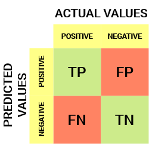
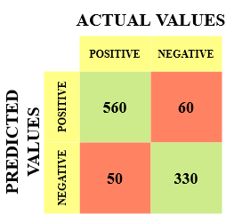
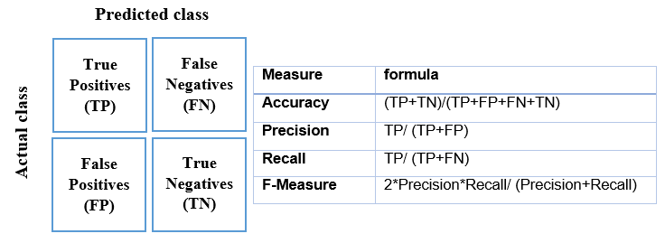
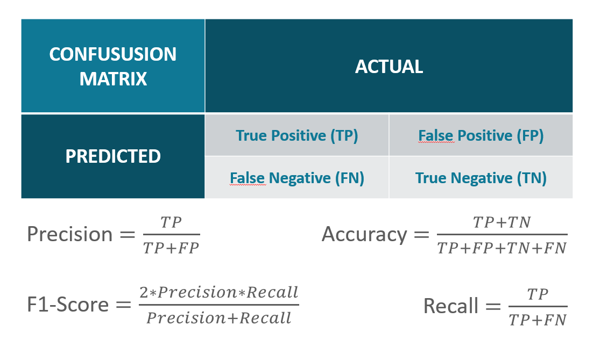
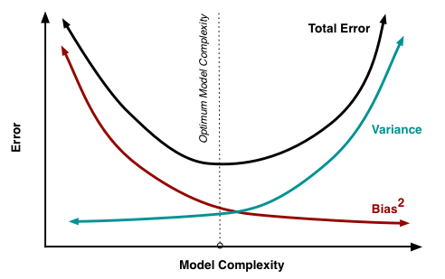
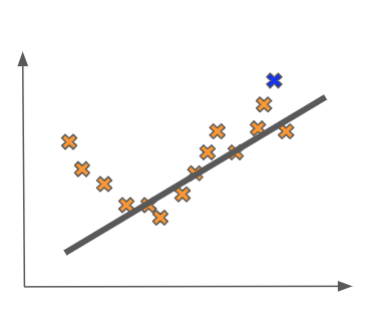
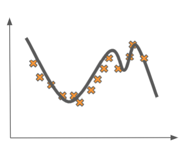

```
If using VSCode to open this file I reccomend:
Markdown Preview Enhanced Extension
```

# Technical Interview Questions


-----
### What is a Confusion Matrix?
-----


Confusion Matrix (calculations by hand and explanations of meaning)

running an ad campaign, out of 100 people we predict 60 will click on our ad. In reality, 54 people did. What is precision, recall, accuracy of this. Which is more important in this case, precision or recall?




- True Positive
    - The predicted value matches the actual value
    - The actual value was positive and the model  predicted a positive value
    
- 
- True Negative
    - The predicted value matches the actual value
    - The actual value was negative and the model predicted a negative value
- 
- False Positive – Type 1 Error
    - The predicted value was falsely predicted
    - The actual value was negative but the model predicted a positive value
    - Also known as the Type 1 error
-  
- False Negative – Type 2 Error
    - The predicted value was falsely predicted
    - The actual value was positive but the model predicted a negative value
    - Also known as the Type 2 error

-----
Let me give you an example to better understand this. Suppose we had a classification dataset with 1000 data points. We fit a classifier on it and get the below confusion matrix:



The different values of the Confusion matrix would be as follows:

- True Positive (TP) = 560; meaning 560 positive class data points were correctly classified by the model
- True Negative (TN) = 330; meaning 330 negative class data points were correctly classified by the model
- False Positive (FP) = 60; meaning 60 negative class data points were incorrectly classified as belonging to the positive class by the model
- False Negative (FN) = 50; meaning 50 positive class data points were incorrectly classified as belonging to the negative class by the model

This turned out to be a pretty decent classifier for our dataset considering the relatively larger number of true positive and true negative values.

Remember the Type 1 and Type 2 errors. Interviewers love to ask the difference between these two!


##### Accuracy (True True over all)
This is all the true positive and true negative results, divided by total of all results.

# $\frac{TP + TN}{TP + FP + TN + FN}$	

Accuracy = $\frac{560 + 330}{560 + 60 + 330 + 50}$ = $\frac{890}{1000}$ = .89 = 89%

##### Precision (p p p) 
Precision is a percentage of true positive predictions that turned out to be correct


# $\frac{TP}{TP + FP}$	

Precision = $\frac{TP}{TP + FP}$ = $\frac{560}{560 + 60}$ = $\frac{560}{620}$ = .90323 = 90.3%


##### Recall'n 

Recall is the percentage of true positive we were able to predict with the model

# $\frac{TP}{TP + FN}$	

Precision = $\frac{TP}{TP + FN}$ = $\frac{560}{560 + 50}$ = $\frac{560}{610}$ = .91803 = 91.8%


Precision is a useful metric in cases where False Positive is a higher concern than False Negatives.

Recall is a useful metric in cases where False Negative trumps False Positive.

Recall is important in medical cases where it doesn’t matter whether we raise a false alarm but the actual positive cases should not go undetected!

In our example, Recall would be a better metric because we don’t want to accidentally discharge an infected person and let them mix with the healthy population thereby spreading the contagious virus. Now you can understand why accuracy was a bad metric for our model.

But there will be cases where there is no clear distinction between whether Precision is more important or Recall. What should we do in those cases? We combine them!

##### F1 Score

#   $\frac{2 * Precision * Recall}{Precision + Recall}$	

F-score = $\frac{2 * .90323 * .91803}{.90323 + .91803}$ = .91056 = 91.1%


-----
to double check I downloaded formulas from a second and third source to verify





-----
### P Value & H<sub>0</sub> & H<sub>1</sub>
-----

 
p value (How to get it, how to interpret, give an example problem)

- Null Hypothesis H<sub>0</sub>
- Alternate Hypothesis H<sub>1</sub>

At this point, a word about error. Type I error is the false rejection of the null hypothesis and type II error is the false acceptance of the null hypothesis. As an aid memoir: think that our cynical society rejects before it accepts.

Good example I saw was this construct:
**So, what if I come to you and say that exercising does not affect weight?**

How can I use statistics to Mathematically or Logically prove that using statistics ?

-----

**Null Hypothesis H<sub>0</sub>**
exercising does not affect weight

**Alternate Hypothesis H<sub>1</sub>**
excercising does affect weight 


We collect weight loss data for a sample of 10 people who regularly exercise for over 3 months.
WeightLoss Sample Mean = 2 kg
Sample Standard Deviation = 1 kg

This would make it appear as though exercise does affect weight, however what if the weight loss was only .2kg how could we show statistically this was significant 

Assuming that the null hypothesis is true, what is the probability of observing a sample mean of 2 kg or more extreme than 2 kg?

This probability value is actually the p-value. Simply, it is just the probability of observing what we observed or extreme results if we assume our null hypothesis to be true.

The statisticians call the threshold as the significance level(𝜶), and in most of the cases, 𝜶 is taken to be 0.05.


Assuming that the null hypothesis is true, what is the probability of getting a value of 2 kg or more than 2 kg?


This is, in fact, the distribution of the mean of the samples from the population. We observed a particular value of the mean that is Xobserved = 2 kg.


As such, this is a very small probability p-value (<significance level of 0.5) for the mean of a sample to take a value of 2 or more.
And so we can reject our Null hypothesis. And we can call our results statistically significant as in they don’t just occur due to mere chance.


***if the p-value was higher than the significance level. Then we say that we fail to reject the null hypothesis.**

Why don’t we say accept the null hypothesis?

In a trial court, the null hypothesis is that the accused is not guilty. Then we see some evidence to disprove the null hypothesis.

If we are not able to disprove the null hypotheses the judge doesn’t say that the accused hasn’t committed the crime. The judge only says that based on the given evidence, we are not able to convict the accused.

-----

Assuming that we are exploring life on an alien planet. And our null hypothesis(Hº) is that there is no life on the planet. We roam around a few miles for some time and look for people/aliens on that planet. If we see any alien, we can reject the null hypothesis in favour of the alternative.

But if we don’t see any alien, can we definitively say that there is no alien life on the planet or accept our null hypotheses? Maybe we needed to explore more, or perhaps we needed more time and we may have found an alien. So, in this case, we cannot accept the null hypothesis; we can only fail to reject it. Or In Cassie Kozyrkov’s words from whom the example comes, we can say that “we learned nothing interesting”.

In essence, hypothesis testing is just about checking if our observed values make the null hypothesis look ridiculous.


-----
### SQL
-----


Sql joins, what are they, and give example of when you would use one of them     
    - Databases (specifically joins/merges?)
- 

-----
### Regularization techniques
-----
Regularization techniques in Neural Networks: name 2 and explain them
    - Neural Network Regularization (L1, L2)


-----
### Bias Variance 
-----

**Bias Variance tradeoff**

The theoretical guarantees behind building supervised learning models. We are going to discuss the bias-variance tradeoff which is one of the most important principles atthe core of machine learning theory.

Besides being important from a theoretical standpoint, the bias-variance tradeoff has very significant implications for the performance of models in practice.

Recall that when we are building a supervised model, we typically train on some collection of labelled data.

After the training is done, we really want to evaluate the model on data it never saw during training. The error incurred on unseen data tests a model’s ability to generalize, and hence it is called the generalization error



- Bias

Bias is caused when we make some incorrect assumptions in our model. In this way, it is analogous to human bias.

A linear regression model will typically have high bias unless the data set has a linear relationship. 

If we fit a straight line (bottom left through top right) through a U shaped set of points it might have a bias towards data in one direction but miss classifying correctly the points on the left side of the U.



The linear fit in our motivating example is said to have a high bias (and hence a lower variance). 

It captures very little of the behavior in the training data, making oversimplifying assumptions about the relationship between the features and the output labels. 

This is evidenced by the fact that the model believes the data was generated by a line when in fact we as omniscient bystanders know it has a quadratic relationship.

- Variance

Variance is caused when our algorithm is really sensitive to minor fluctuations in the training set of our data. In the examples we presented above, the complex polynomial fit is said to have a high variance




Decision Trees tend to have high variance, the deeper the tree the more specifics of the trainind data they are sensitive to. This can cause them to be bad at predicting new data if they overfit the training data. 


### Train test split

If we throw out some of our data to be used to test on at the end we are not getting the full benefit of the information to create an accurate model

K fold cross validation allows us to split the data into multiple pieces called folds and do training and testing on smaller subsets of the data iteratively

Let’s make this concrete by assuming we are using 4 folds. This means we are going to train and evaluate each model 4 times.

During the first iteration, we are going to take the first fold

That first fold will function as our testing set. In other words, we will train on all of the remaining data, except that first fold, and then at the end test our model on that fold. This will give us some error that we will call E1.

In the second iteration, we take the second fold of our data cross validation fold 2 and again train on all the data except that second fold. 

At the end of training, we then test on that second fold, giving us a new error: E2. We then repeat this for the remaining folds:

Training on all but the third fold and then testing on the third fold gives cross validation fold 3
This produces an error E3. 

And finally repeating for the fourth fold cross validation fold 4 give us an error E4.

Once we have tested on all the 4 folds, we compute the final generalization error of our model as the average of E1, E2, E3, and E4.

One important note is that each fold is an independent run, where we train a new model from scratch. This means no model weights are transferred between folds.

-----
# Behavioral Interview Questions
-----


1. Why did you pick this career, tie in your background - Why Data science

2. Talk about an interesting or difficult dataset

3. A big win or triumph in a project

4. Have you had a problem with a team-member or manager or stakeholder how did you handle it 


H^3^    
$\alpha$	 	


Got some great information from this article on confusion matrix 
https://www.analyticsvidhya.com/blog/2020/04/confusion-matrix-machine-learning/